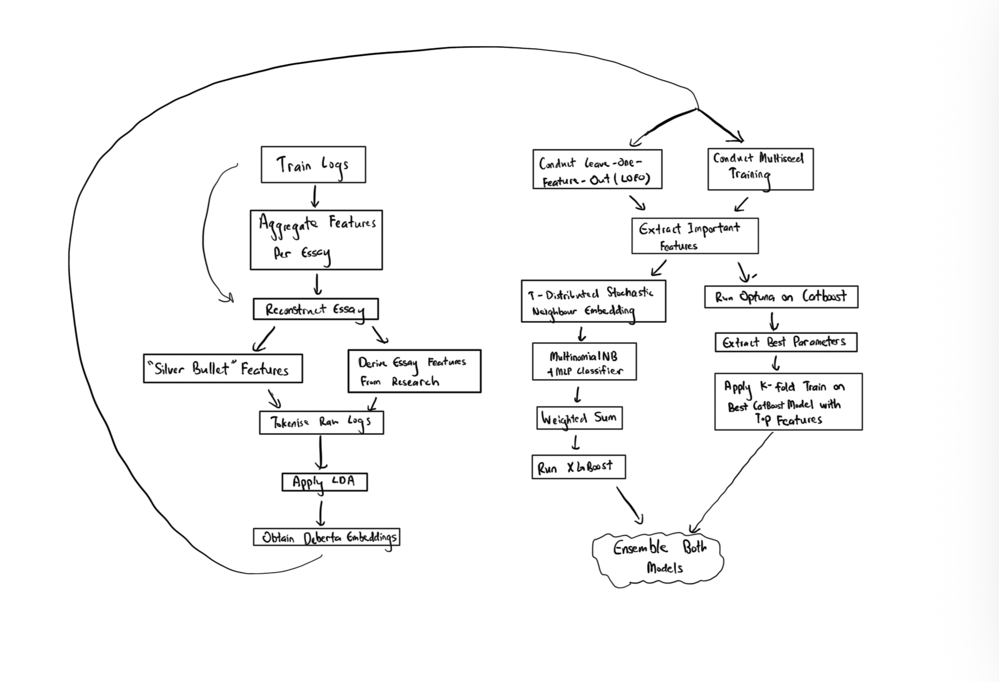

<h1 align="center">Essay Quality Prediction📝</h1>

## About:
This repository contains our group's solution for the closed Kaggle competition [**Linking Writing Processes to Writing Quality**](https://www.kaggle.com/competitions/linking-writing-processes-to-writing-quality), where the goal is to use typing behaviour to predict essay quality. The full dataset and competition information can be found on [**Kaggle**](https://www.kaggle.com/competitions/linking-writing-processes-to-writing-quality/data). This project was done as a school learning project, developed with reference to several winning solutions from the competition.

## Techniques Used:
- 🔤 **Text Representation**
  - Tokenisation
  - DeBERTa embeddings

- 🧩 **Topic & Feature Engineering**
  - Latent Dirichlet Allocation (LDA) for topic features
  - Hand-crafted features from typing behaviour
  - LOFO (Leave One Feature Out) importance analysis
  - t-SNE for visualising feature space

- 🤖 **Models**
  - Multinomial Naive Bayes
  - MLP (Multi-Layer Perceptron)
  - XGBoost, LightGBM, CatBoost
  - TabPFN
  - Hyperparameter tuning with Optuna

## Proposed Solution

## Contributors:

| Name                        | GitHub Profile                                   | Contact                                       |
|-----------------------------|--------------------------------------------------|-----------------------------------------------|
| Wee Zi Hao                  | [27July](https://github.com/27July)              |   |
| Ryan Paulo Perez Mendoza                 |-             | -                                             |
| Trevyen Yezdi Darukhanawalla |-  | -                                             |
| Phang Wei Zhang            | -                                                | -                                             |
